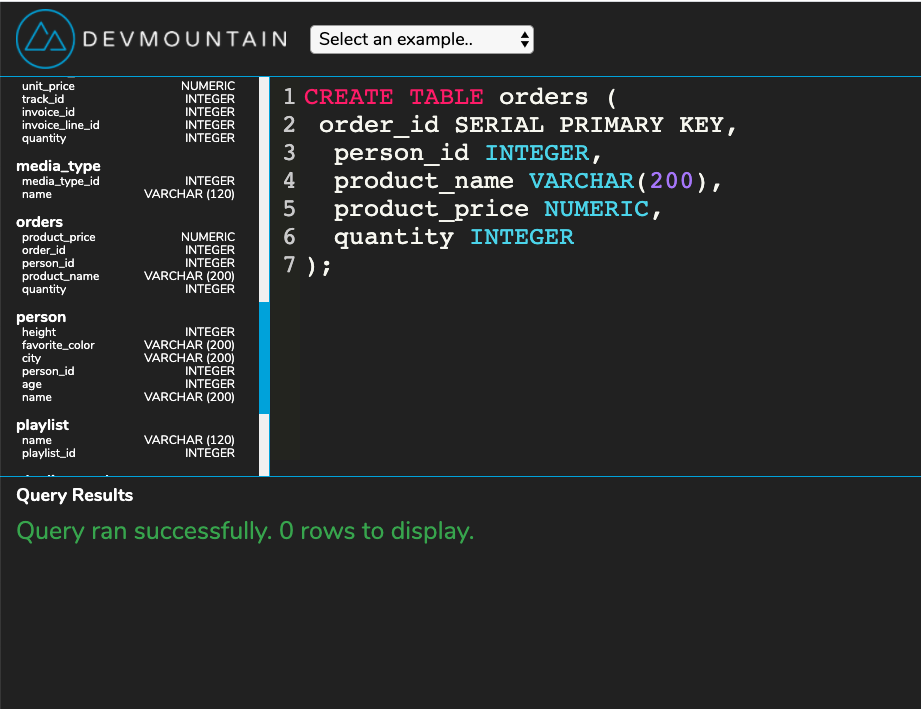

# SQL 1 Afternoon

## Instructions

1. Create a table called person that records a person's id, name, age, height ( in cm ), city, favorite_color.

2. Add 5 different people into the person database.

3. List all the people in the person table by height from tallest to shortest.

4. List all the people in the person table by height from shortest to tallest.

5. List all the people in the person table by age from oldest to youngest.

6. List all the people in the person table older than age 20.

7. List all the people in the person table that are exactly 18.

8. List all the people in the person table that are less than 20 and older than 30.

9. List all the people in the person table that are not 27 (Use not equals).

10. List all the people in the person table where their favorite color is not red.

11. List all the people in the person table where their favorite color is not red and is not blue.

12. List all the people in the person table where their favorite color is orange or green.

13. List all the people in the person table where their favorite color is orange, green or blue (use IN).

14. List all the people in the person table where their favorite color is yellow or purple (use IN).

## Table - orders

1. Create a table called orders that records: order_id, person_id, product_name, product_price, quantity.

2. Add 5 orders to the orders table.

3. Select all the records from the orders table.

4. Calculate the total number of products ordered.

5. Calculate the total order price.

6. Calculate the total order price by a single person_id.

## Table - Artist

1. Add 3 new artists to the artist table. ( It's already created )

2. Select 10 artists in reverse alphabetical order.

3. Select 5 artists in alphabetical order.

4. Select all artists that start with the word 'Black'.

5. Select all artists that contain the word 'Black'.

## Table - Employee

1. List all employee first and last names only that live in Calgary.

2. Find the birthdate for the youngest employee.

3. Find the birthdate for the oldest employee.

4. Find everyone that reports to Nancy Edwards (Use the ReportsTo column).

5. Count how many people live in Lethbridge.

## Table - Invoice

1. Count how many orders were made from the USA.

2. Find the largest order total amount.

3. Find the smallest order total amount.

4. Find all orders bigger than $5.

5. Count how many orders were smaller than $5.

6. Count how many orders were in CA, TX, or AZ (use IN).

7. Get the average total of the orders.

8. Get the total sum of the orders.

